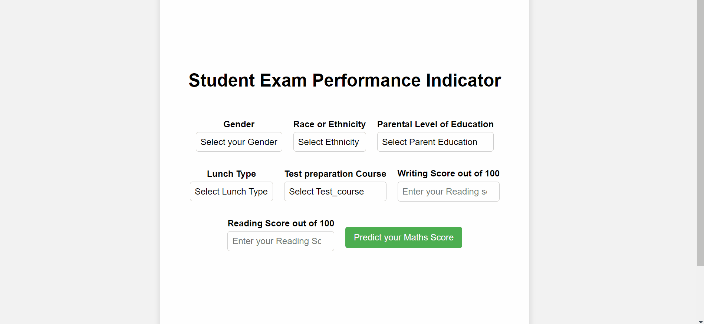

## Student Performance Analysis System

Welcome to the Student Performance Analysis System project. This system is designed to analyze and visualize student performance data to help educators make informed decisions.

### Features
- Data import from various sources
- Performance metrics calculation
- Interactive visualizations
- Customizable reports

### Video Demonstration
Watch the video below to see the project in action:

### Contributing
Contributions are welcome!

